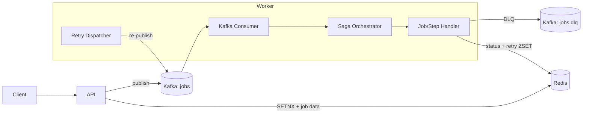

# Architecture

## Goals
- High-throughput ingestion with Kafka as the primary queue.
- At-least-once processing with explicit offset commits after successful handling.
- Idempotency and job status visibility via Redis.
- Retry with exponential backoff and DLQ for poison messages.
- Optional Saga orchestration with compensating actions for multi-step workflows.

## Diagram

## Components
- **API**: accepts `POST /jobs`, deduplicates via Redis, publishes to Kafka.
- **Worker**: consumes Kafka, processes jobs, updates status, schedules retries or DLQ.
- **Redis**: stores job status + job payload snapshot; retry scheduling via ZSET.
- **Kafka**: main queue (`jobs`) and DLQ (`jobs.dlq`).

## Data Model (Redis)
- `job:<id>`: status string (TTL)
- `job:data:<id>`: JSON snapshot (TTL)
- `retry:jobs` (ZSET): score = next retry time (ms), member = job id
- `retry:lock`: simple dispatcher lock

## Job Lifecycle
States (status key):
- `queued` -> `processing` -> `done`
- `processing` -> `retrying` -> `queued`
- `processing` -> `dlq`
- `saga_running` -> `saga_step_failed` -> `retrying`
- `saga_compensating` -> `saga_compensated` -> `dlq`

## Flow: Happy Path
1. Client calls `POST /jobs`.
2. API does `SETNX job:<id> = queued` for idempotency.
3. API stores `job:data:<id>` and publishes to Kafka.
4. Worker `FetchMessage` from Kafka.
5. Worker sets `processing`, executes task.
6. Worker sets `done` and commits offset.

## Flow: Failure + Retry
1. Worker fails a job.
2. If attempt < `MAX_ATTEMPTS`:
   - Increment attempt
   - Schedule retry: `ZADD retry:jobs score=now+backoff`.
   - Set status `retrying`.
3. Retry dispatcher polls due entries:
   - Loads `job:data:<id>`.
   - Republishes to Kafka.
   - Sets status `queued` and removes from ZSET.

## Flow: DLQ
1. If attempt reaches `MAX_ATTEMPTS`:
   - Status `dlq`.
   - Publish to `jobs.dlq`.
   - Commit offset.

## Flow: Saga (Orchestrated)
1. API accepts a job with `saga.steps[]` in the payload.
2. Worker runs steps in order, updating `saga.current` in job data.
3. If a step fails, the job is retried from the failed step (at-least-once).
4. If retries are exhausted, the worker runs compensations in reverse order and sends the job to DLQ.

## At-Least-Once Semantics
- **Manual commit** ensures we only commit Kafka offsets after processing.
- Possible duplicates are handled by idempotency + status checks.

## Idempotency Strategy
- **Write-time**: `SETNX job:<id>` prevents duplicate enqueue.
- **Read-time**: worker checks `job:<id>`; if `done`, it skips.

## Operational Considerations
- Retry dispatcher uses a Redis lock to reduce duplicate republish.
- Backoff is bounded to avoid extreme delays.
- Status TTL ensures Redis doesn’t grow unbounded.

## Failure Modes And Multi-Node Behavior
- Duplicates are expected under failures; idempotency is required end-to-end.
- API fails open if Redis is unavailable; dedupe may be degraded.
- Worker commits offsets only after Redis state updates succeed.
- Retry dispatcher uses short-lived locks and atomic claims to reduce duplicate requeue.
- Reconciliation sweeper is recommended for stale `queued` and `processing` jobs.
- Details: `design/failure-modes-discussion.md` and `spec/consistency-and-degradation-spec.md`.

## Observability
- Track enqueue, processing, retry, and delivery with metrics, logs, and traces.
- Correlate by `job_id`, `idempotency_key`, and `tenant_id` without logging payloads.
- Alert on error rate, latency SLO breaches, retry backlog, and DLQ spikes.
- Details: `design/observability-discussion.md` and `spec/observability-spec.md`.

## Disaster Recovery And Multi-Region
- Baseline: active-active regions with async replication.
- Avoid cross-region synchronous writes on the hot path.
- Failover is controlled with reconciliation to handle duplicates and stale states.
- Details: `design/disaster-recovery-multiregion-discussion.md` and `spec/disaster-recovery-multiregion-spec.md`.

## Default Assumptions (Typical SaaS Webhook)
- Throughput: avg 1k msg/s, peak 10k msg/s (up to 10 minutes).
- ACK latency: P95 < 150ms, P99 < 300ms.
- End-to-end delivery: P95 < 10s, P99 < 60s (including backlog).
- Error rate: enqueue availability 99.9%; successful delivery (within 24h) 99.9%.
- Duplicates: allowed (at-least-once); idempotency key required.
- Payload: 1–256KB (use pointer for >256KB).
- TTL: dedupe 72h; job/delivery log 14d; DLQ 14d.
- Environment: K8s, multi-worker, supports rolling restarts.

## Test Checklist (Typical SaaS Webhook)
1. Ingestion throughput sustains 1k msg/s average and 10k msg/s peak for 10 minutes without enqueue failures.
2. ACK latency meets P95 < 150ms and P99 < 300ms under both average and peak load.
3. End-to-end delivery meets P95 < 10s and P99 < 60s with realistic backlog.
4. Enqueue availability meets 99.9% over a 24h window.
5. Successful delivery within 24h meets 99.9% over a 24h window.
6. Idempotency key prevents duplicate enqueue and duplicate processing under retries and redelivery.
7. Payload sizes from 1KB to 256KB succeed; >256KB uses pointer flow and completes.
8. Dedupe TTL is enforced at 72h; job/delivery logs expire at 14d; DLQ entries expire at 14d.
9. Retry backoff schedules and replays correctly; DLQ routing after MAX_ATTEMPTS works.
10. Rolling restarts on K8s do not cause message loss; in-flight jobs complete or retry safely.

## Bottom-Up Implementation Plan
1. Redis key/TTL helpers.
2. Job state machine model.
3. Idempotency logic (pure functions).
4. Payload rules (1–256KB vs pointer).
5. Redis store interface (in-memory mock + contract).
6. Retry scheduler logic (backoff and ZSET decisions).
7. DLQ decision logic.
8. Kafka abstraction (interfaces + mocks).
9. Worker core (status updates + retry/DLQ decisions).
10. Retry dispatcher loop (claim + republish).
11. API enqueue flow (SETNX -> job:data -> publish).
12. Saga/distributed transaction (steps + compensation).
13. Multi-node behavior (locks + contention).
14. Observability hooks (metrics/log/tracing interfaces).

## Extension Points
- Metrics: processing latency, queue lag, retry count, DLQ count.
- K8s: scale workers via HPA, Kafka/ZooKeeper as stateful sets or managed service.
